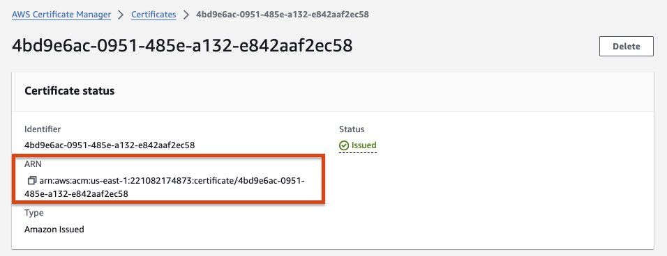
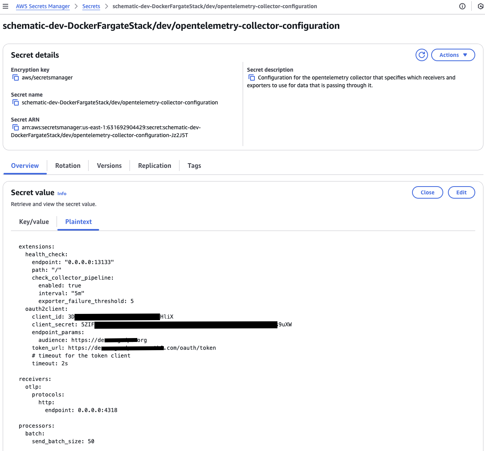
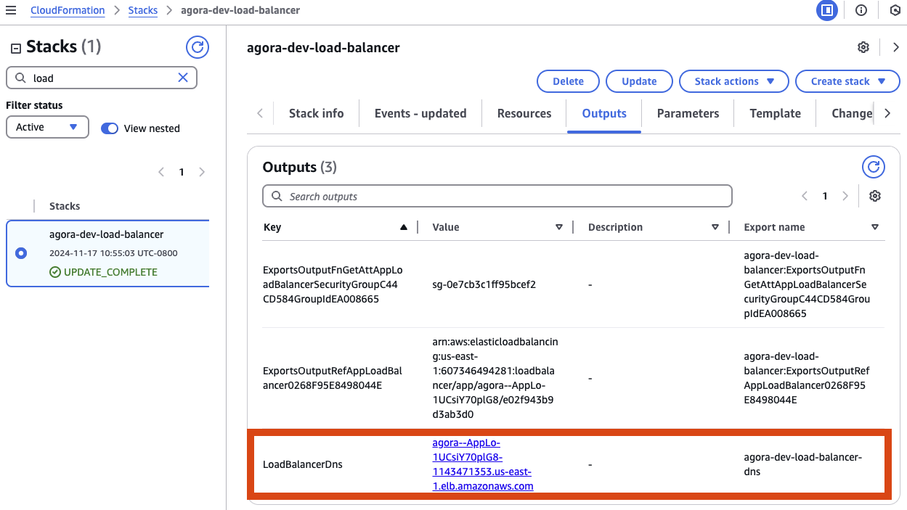
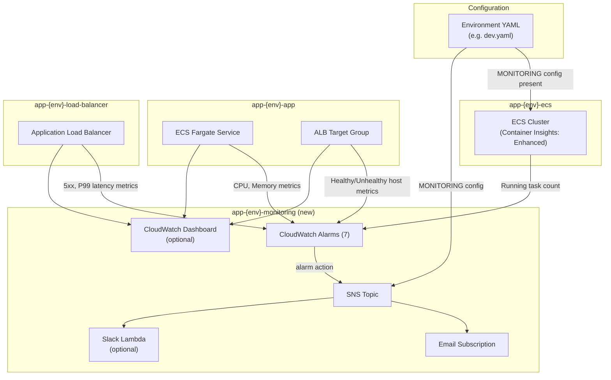
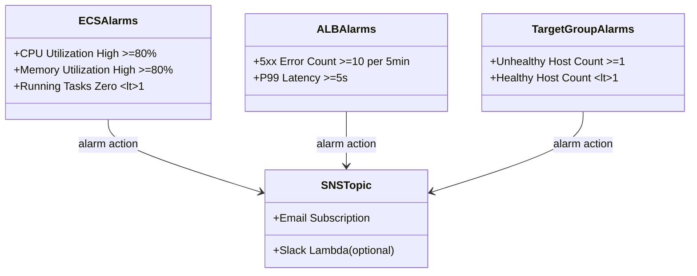
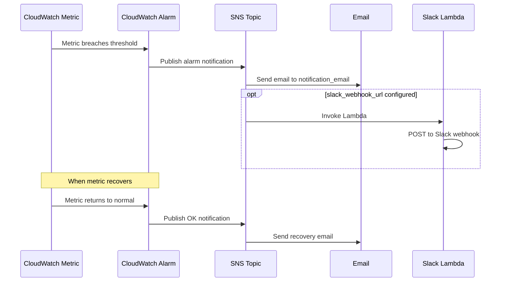
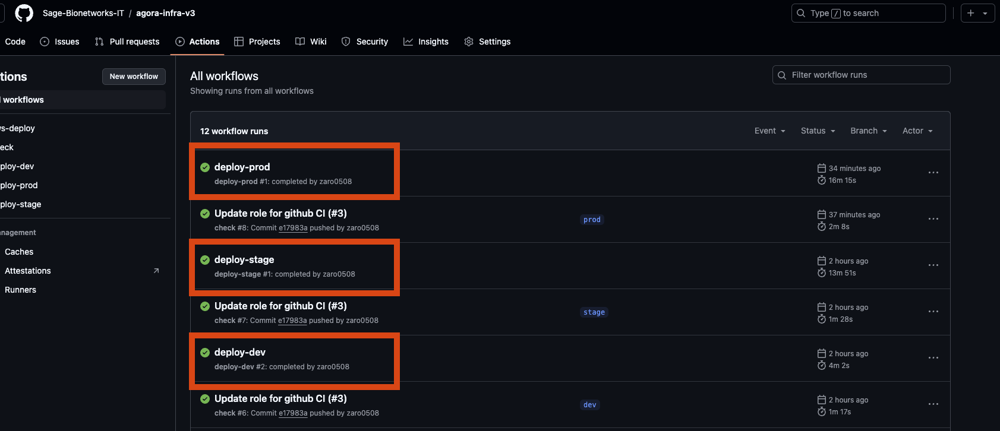

# sage-kb-chatbot-infra

AWS CDK infrastructure for the [Sage Internal Knowledge Slack Chatbot][sage-kb-chatbot]. Deploys the ECS Fargate
service, networking, load balancer, Bedrock Agent, and optional monitoring into AWS.


[sage-kb-chatbot]: https://github.com/Sage-Bionetworks-IT/sage-kb-chatbot

# Prerequisites

AWS CDK projects require some bootstrapping before synthesis or deployment.
Please review the [bootstapping documentation](https://docs.aws.amazon.com/cdk/v2/guide/getting_started.html#getting_started_bootstrap)
before development.

> [!Note]
> Sage IT deploys this CDK bootstrap upon creation of every AWS account in our AWS Organization.

# Dev Container

This repository provides a [dev container](https://containers.dev/) that includes all the tools
required to develop this AWS CDK app.

## Opening the project inside its dev container

With VS Code:

1. Clone this repo
2. File > Open Folder...
3. A prompt should invite you to open the project inside the dev container. If not, open VS Code
    Command Palette and select "Dev Containers: Open Folder in Container..."

With GitHub Codespaces:

1. From the main page of this repository, click on the button "Code" > Codespaces > Click on the
   button "Create codespace"

That's it! You are now inside the dev container and have access to all the development tools.

# Development

All the development tools are provided when developing inside the dev container
(see above). These tools include Python, AWS CLI, AWS CDK CLI, etc. These tools
also include a Python virtual environment where all the Python packages needed
are already installed.

If you decide the develop outside of the dev container, some of the development
tools can be installed by running:

```console
./tools/setup.sh
```

Development requires the activation of the Python virtual environment:

```
$ source .venv/bin/activate
```

At this point you can now synthesize the CloudFormation template for this code.

```
$ cdk synth
```

To add additional dependencies, for example other CDK libraries, just add
them to your `setup.py` file and rerun the `pip install -r requirements.txt`
command.

## Useful commands

 * `cdk ls`          list all stacks in the app
 * `cdk synth`       emits the synthesized CloudFormation template
 * `cdk deploy`      deploy this stack to your default AWS account/region
 * `cdk diff`        compare deployed stack with current state
 * `cdk docs`        open CDK documentation


# Testing

## Static Analysis

As a pre-deployment step we syntactically validate the CDK json, yaml and
python files with [pre-commit](https://pre-commit.com).

Please install pre-commit, once installed the file validations will
automatically run on every commit.  Alternatively you can manually
execute the validations by running `pre-commit run --all-files`.

Verify CDK to Cloudformation conversion by running [cdk synth]:

```console
cdk synth --context env=dev
```

The Cloudformation output is saved to the `cdk.out` folder

## Unit Tests

Tests are available in the tests folder. Execute the following to run tests:

```
python -m pytest tests/ -s -v
```


## Environments

When running `cdk` commands, you must specify which environment's
configuration to use.  This is done by passing a context variable to
CDK, which loads environment-specific parameters.

Create a configuration file in the [config folder](./config) for each environment
(e.g., `dev.yaml`, `prod.yaml`).  Both yaml and json files are supported.
The supported environments are dev, stage, and prod.

To synthesize or deploy using the `prod` environment configuration:

```console
cdk synth --context env=prod
```

There is also an optional base configuration file that is always loaded
and merged with one of the passed in environment configuration.

The values from the environment-specific configuration file will
override those in the base configuration file if there are conflicts.
For example, if both files define `TAGS`, the value from `dev.yaml`
will take precedence.


> [!NOTE]
> Ensure that `VPC_CIDR` is unique within your AWS organization.
Refer to our [guidance](https://sagebionetworks.jira.com/wiki/spaces/IT/pages/2850586648/Setup+AWS+VPC) on selecting a unique CIDR block.

## Certificates

Certificates to set up HTTPS connections should be created manually in AWS certificate manager.
This is not automated due to AWS requiring manual verification of the domain ownership.
Once created take the ARN of the certificate and set that ARN in environment_variables.



## Container image

The container image for a service is set via the `container_location` field on the
`ServiceProps` object in [app.py](app.py). Two forms are supported:

| Form | Example | Behavior |
|------|---------|----------|
| Docker registry reference | `ghcr.io/sage-bionetworks/app:latest`<br>`nginx:1.27`<br>`123456789012.dkr.ecr.us-east-1.amazonaws.com/app:v1.0` | Pulls a pre-built image from a registry (Docker Hub, GHCR, Amazon ECR, etc.). Include an explicit tag; omitting one defaults to `:latest`. |
| Local build path (`path://`) | `path://docker/MyContainer` | Builds the image from a local Dockerfile at the given path (relative to the project root) at deploy time and uploads it to the CDK asset bucket. The `path://` prefix is stripped before the directory is passed to `ContainerImage.from_asset`. |

```python
from src.service_props import ServiceProps

# Pull a pre-built image from a registry
app_props = ServiceProps(
    container_name="app",
    container_port=80,
    container_location="ghcr.io/sage-bionetworks/app:v1.0",
)

# Build the image from a local Dockerfile at deploy time (supports relative path)
app_props = ServiceProps(
    container_name="app",
    container_port=80,
    container_location="path://docker/MyContainer",
)
```

## Secrets

Secrets can be manually created in the
[AWS Secrets Manager](https://docs.aws.amazon.com/secretsmanager/latest/userguide/create_secret.html).
When naming your secret make sure that the secret does not end in a pattern that matches
`-??????`, this will cause issues with how AWS CDK looks up secrets.

To pass secrets to a container set the secrets manager `container_secrets`
when creating a `ServiceProp` object. You'll be creating a list of `ServiceSecret` objects:
```python
from src.service_props import ServiceProps, ServiceSecret

app_service_props = ServiceProps(
    ecs_task_cpu=256,
    ecs_task_memory=512,
    container_name="app",
    container_port=443,
    container_location="ghcr.io/sage-bionetworks/app:v1.0",
    container_secrets=[
        ServiceSecret(
            secret_name="app/dev/DATABASE",
            environment_key="NAME_OF_ENVIRONMENT_VARIABLE_SET_FOR_CONTAINER",
        ),
        ServiceSecret(
            secret_name="app/dev/PASSWORD",
            environment_key="SINGLE_VALUE_SECRET",
        )
    ]
)
```

For example, the KVs for `app/dev/DATABASE` could be:
```json
{
    "DATABASE_USER": "maria",
    "DATABASE_PASSWORD": "password"
}
```

And the value for `app/dev/PASSWORD` could be: `password`

In the application (Python) code the secrets may be loaded into a dict using code like:

```python
import json
import os

all_secrets_dict = json.loads(os.environ["NAME_OF_ENVIRONMENT_VARIABLE_SET_FOR_CONTAINER"])
```

In the case of a single value you may load the value like:

```python
import os

my_secret = os.environ.get("SINGLE_VALUE_SECRET", None)
```


> [!NOTE]
> Retrieving secrets requires access to the AWS Secrets Manager

## DNS

A DNS CNAME must be created in org-formation after the initial
deployment of the application to make the application available at the desired
URL. The CDK application exports the DNS name of the Application Load Balancer
to be consumed in org-formation. [An example PR setting up a CNAME](https://github.com/Sage-Bionetworks-IT/organizations-infra/pull/1299).

Login to the AWS cloudformation console and navigate to the deployed stack `app-load-balancer`
and click on the `Outputs` tab.  On the row whose key is `LoadBalancerDNS` look for the
value in the `Export Name` column, e.g., `app-dev-load-balancer-dns`.


Now use the name in the `TargetHostName` definition, for example:

```
TargetHostName: !CopyValue [!Sub 'app-dev-load-balancer-dns', !Ref DnTDevAccount]
```

(You would also replace `DnTDevAccount` with the name of the account in which the application is deployed.)

> [!NOTE]
> Setting up the DNS cname should be done at the very end of this infra setup


## Monitoring (Optional)

This template includes an opt-in monitoring stack that provides CloudWatch alarms,
SNS notifications, and a CloudWatch dashboard for your ECS service. **No monitoring
resources are created unless you explicitly configure them.**

### How It Fits Together

When monitoring is enabled, the template creates a fifth CloudFormation stack
(`app-{env}-monitoring`) that references resources from the other stacks. It also
enables [ECS Container Insights (Enhanced)](https://docs.aws.amazon.com/AmazonCloudWatch/latest/monitoring/ContainerInsights.html)
on the ECS cluster, which is required for the RunningTaskCount metric.



> [!NOTE]
> The monitoring stack is designed for `LoadBalancedServiceStack` (the default
> in this template). It requires an ALB target group for the healthy/unhealthy
> host alarms. If you modify the template to use the base `ServiceStack` without
> an ALB, you will need to adapt the monitoring stack accordingly.

> [!NOTE]
> Enabling monitoring turns on
> [ECS Container Insights (Enhanced)](https://docs.aws.amazon.com/AmazonCloudWatch/latest/monitoring/ContainerInsights.html)
> on the ECS cluster. This adds a small cost (~$0.50/container/month) but is
> required for the RunningTaskCount metric and provides richer observability.

### Alarm Coverage



### Enabling Monitoring

Default monitoring settings (disabled) live in `config/base.yaml`. To activate,
override `enabled` and `notification_email` in your environment config:

```yaml
# config/dev.yaml
MONITORING:
  enabled: true
  notification_email: "team@example.com"
```

This creates:
- An SNS topic with an email subscription (you must confirm the subscription via email)
- 7 CloudWatch alarms with sensible default thresholds
- A CloudWatch dashboard with ECS, ALB, and health widgets
- ECS Container Insights (Enhanced) on the cluster

### Full Configuration Reference

All fields except `enabled` and `notification_email` have defaults in `config/base.yaml`:

```yaml
MONITORING:
  enabled: true                                # Required - activates the monitoring stack
  notification_email: "team@example.com"       # Required - SNS email subscription
  slack_webhook_url: ""                         # Optional - Slack incoming webhook URL for alerts
  enable_dashboard: true                        # Optional - creates a CloudWatch dashboard (default: true)
  alarms:                                       # Optional - override default alarm thresholds
    ecs_cpu_threshold: 80                       # CPU utilization % (default: 80)
    ecs_memory_threshold: 80                    # Memory utilization % (default: 80)
    alb_5xx_threshold: 10                       # 5xx error count per 5min (default: 10)
    alb_p99_latency_threshold: 5                # P99 response time in seconds (default: 5)
    unhealthy_host_threshold: 1                 # Unhealthy host count to trigger alarm (default: 1)
    healthy_host_min: 1                         # Minimum healthy hosts before alarm (default: 1)
    running_task_min: 1                         # Minimum running tasks before alarm (default: 1)
```

You can override individual alarm thresholds without specifying all of them.
For example, to only tighten the CPU threshold for production:

```yaml
# config/prod.yaml
MONITORING:
  enabled: true
  notification_email: "oncall@example.com"
  alarms:
    ecs_cpu_threshold: 70
```

### Notification Flow



> [!NOTE]
> After deployment, you must confirm the SNS email subscription by clicking the
> link in the confirmation email sent to `notification_email`. Until confirmed,
> no email alerts will be delivered.

### Dashboard

When enabled (default), the CloudWatch dashboard provides three sections:

| Section | Widgets |
|---------|---------|
| **ECS Service** | CPU utilization, Memory utilization, Running task count |
| **Load Balancer** | Requests & errors (4xx/5xx), Target response time (p50/p90/p99) |
| **Health** | Healthy/unhealthy host count, Active connections, Running tasks alarm |

After deployment, the dashboard URL is printed as a CloudFormation output.
You can also find it in the AWS Console under CloudFormation > Stacks >
`app-{env}-monitoring` > Outputs > `DashboardUrl`.

### Disabling Monitoring

To disable monitoring, remove or comment out the `MONITORING` section
from your environment config file. On the next deployment, you can delete the
monitoring stack:

```console
cdk destroy app-{env}-monitoring --context env={env}
```

> [!NOTE]
> Removing the `MONITORING` config also disables Container Insights on the ECS
> cluster on the next deploy, removing its associated cost.

## Debugging

Generally CDK deployments will create cloudformation events during a CDK deploy.
The events can be viewed in the AWS console under the cloudformation service page.
Viewing those events will help with errors during a deployment.  Below are cases
where it might be difficult to debug due to misleading or insufficient error
messages from AWS

### Missing Secrets

Each new environment (dev/staging/prod/etc..) may require adding secrets.  If a
secret is not created for the environment you may get an error with the following
stack trace..
```
Resource handler returned message: "Error occurred during operation 'ECS Deployment Circuit Breaker was triggered'." (RequestToken: d180e115-ba94-d8a2-acf9-abe17a3aaed9, HandlerErrorCode: GeneralServiceException)
    new BaseService (/private/var/folders/qr/ztb40vmn2pncyh8jpsgfnrt40000gp/T/jsii-kernel-4PEWmj/node_modules/aws-cdk-lib/aws-ecs/lib/base/base-service.js:1:3583)
    \_ new FargateService (/private/var/folders/qr/ztb40vmn2pncyh8jpsgfnrt40000gp/T/jsii-kernel-4PEWmj/node_modules/aws-cdk-lib/aws-ecs/lib/fargate/fargate-service.js:1:967)
    \_ new ApplicationLoadBalancedFargateService (/private/var/folders/qr/ztb40vmn2pncyh8jpsgfnrt40000gp/T/jsii-kernel-4PEWmj/node_modules/aws-cdk-lib/aws-ecs-patterns/lib/fargate/application-load-balanced-fargate-service.js:1:2300)
    \_ Kernel._create (/private/var/folders/qr/ztb40vmn2pncyh8jpsgfnrt40000gp/T/tmpqkmckdm2/lib/program.js:9964:29)
    \_ Kernel.create (/private/var/folders/qr/ztb40vmn2pncyh8jpsgfnrt40000gp/T/tmpqkmckdm2/lib/program.js:9693:29)
    \_ KernelHost.processRequest (/private/var/folders/qr/ztb40vmn2pncyh8jpsgfnrt40000gp/T/tmpqkmckdm2/lib/program.js:11544:36)
    \_ KernelHost.run (/private/var/folders/qr/ztb40vmn2pncyh8jpsgfnrt40000gp/T/tmpqkmckdm2/lib/program.js:11504:22)
    \_ Immediate._onImmediate (/private/var/folders/qr/ztb40vmn2pncyh8jpsgfnrt40000gp/T/tmpqkmckdm2/lib/program.js:11505:46)
    \_ processImmediate (node:internal/timers:464:21)
```

# Deployment

## Bootstrap

There are a few items that need to be manually bootstrapped before deploying the application.

* Add secrets to the AWS Secrets Manager
* Create an [ACM certificate for the application](#Certificates) using the AWS Certificates Manager
* Update environment_variables in [app.py](app.py) with variable specific to each environment.
* Update references to the docker images in [app.py](app.py)
  (i.e. `ghcr.io/sage-bionetworks/app-xxx:<tag>`)
* (Optional) Update the `ServiceProps` objects in [app.py](app.py) with parameters specific to
  each container.

## Login with the AWS CLI

> [!NOTE]
> This and the following sections assume that you are working in the AWS account
> `org-sagebase-itsandbox` with the role `Developer` and that you are deploying
> to the `us-east-1` region. If this assumption is correct, you should be able
> to simply copy-paste the following commands, otherwise adapting the
> configuration should be straightforward.

Create the config file if it doesn't exist yet.

```console
mkdir ~/.aws && touch ~/.aws/config
```

As a Developer working in Sage IT Sandbox AWS account, add the following profile to the config file.

```ini
[profile itsandbox-dev]
sso_start_url = https://d-906769aa66.awsapps.com/start
sso_region = us-east-1
sso_account_id = XXXXXXXXX
sso_role_name = Developer
```

Login with the AWS CLI:

```console
aws --profile itsandbox-dev sso login
```


## Deploy

Deployment requires setting up an [AWS profile](https://docs.aws.amazon.com/cli/latest/userguide/getting-started-quickstart.html)
then executing the following command:

```console
AWS_PROFILE=itsandbox-dev AWS_DEFAULT_REGION=us-east-1 cdk deploy --context env=dev --all
```

## Force new deployment

```console
AWS_PROFILE=itsandbox-dev AWS_DEFAULT_REGION=us-east-1 aws ecs update-service \
  --cluster <cluster-name> \
  --service <service-name> \
  --force-new-deployment
```

# Execute a command from a container running on ECS

Once a container has been deployed successfully it is accessible for debugging using the
[ECS execute-command](https://docs.aws.amazon.com/cli/latest/reference/ecs/execute-command.html)

Example to get an interactive shell run into a container:

```console
AWS_PROFILE=itsandbox-dev AWS_DEFAULT_REGION=us-east-1 aws ecs execute-command \
  --cluster AppEcs-ClusterEB0386A7-BygXkQgSvdjY \
  --task a2916461f65747f390fd3e29f1b387d8 \
  --container app-mariadb \
  --command "/bin/sh" --interactive
```

# CI Workflow

This repo has been set up to use Github Actions CI to continuously deploy the application.

The workflow for continuous integration:

* Create PR from the git dev branch
* PR is reviewed and approved
* PR is merged
* CI deploys changes to the dev environment (dev.app.io) in the AWS dev account.
* Changes are promoted (or merged) to the git stage branch.
* CI deploys changes to the staging environment (stage.app.io) in the AWS prod account.
* Changes are promoted (or merged) to the git prod branch.
* CI deploys changes to the prod environment (prod.app.io) in the AWS prod account.


